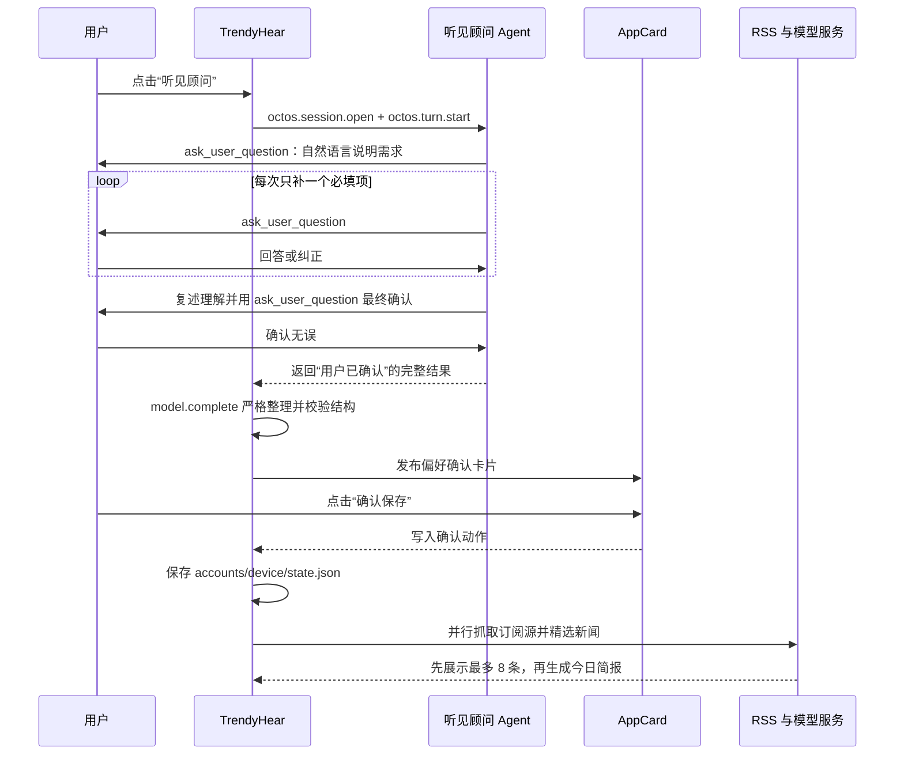

# TrendyHear · 听见 0.4.4

TrendyHear 是面向 OctoSense 的个性化新闻聚合 Agent 应用，应用 ID 为 `skystream.trendyhear`。它使用官方 Shell 已提供的 App Agent、`ask_user_question`、AppCard、模型服务和应用账户存储，不修改 OctoSense Shell，也不依赖任何 TrendyHear 专属宿主权限。

## 体验目标

用户用自然语言告诉“听见顾问”想关注什么。顾问逐项补齐必要信息、理解主题语义和优先级，并用通俗语言复述。用户确认后，TrendyHear 再用 AppCard 展示可保存的偏好。只有点击卡片中的“确认保存”，应用才会写入偏好并立即开始新闻任务。

新闻列表优先出现，今日简报在后台生成完成后填入页面顶部。用户无需等待每日设定时间，首次确认会立刻试跑一次。

## 0.4.4 的混合式 Agent 工作流



### Agent 负责什么

- 区分长期订阅、仅本次查询、暂停和恢复。
- 理解最多三个新闻主题，并确认主题优先级。
- 长期订阅缺少时间时，询问上海时间 `HH:MM` 或按需阅读。
- 一次只询问一个缺失的必填项。
- 阅读用途和细分范围是选填项，缺失时不会增加问题。
- 信息完整后复述自己的理解，并再次使用 `ask_user_question` 获取明确确认。
- 最终只返回已经确认的意图，不声称已经保存、发卡或抓取新闻。

### 应用负责什么

- 校验 Agent 返回结果，并要求 `confirmed=true`。仍在等待确认的结果不会进入下一步。
- 发布固定模板 AppCard，展示操作类型、主题顺序、时间和通俗释义。
- 在卡片确认前保持持久偏好和新闻任务不变。
- 卡片确认后由应用自身写入 `accounts/device/`，随后立即启动 RSS 聚合。
- 提供模型不可用时的“快速设置”备用入口。

这种分工让模型负责理解和对话，让应用负责权限、状态变更和执行边界。新闻任务不会由模型直接写文件或直接调用网络。

## 为什么不直接读取 “Ask TrendyHear” 面板

当前官方桌面 Shell 的 “Ask <app>” 面板使用独立的 `shell-ask` instance；应用调用 `octos.session.open` 获得的是自己的 contained app instance。现有 `octos.session.history` 只返回调用方 instance 对应的会话记录，因此 TrendyHear 无法可靠读取用户在独立 Ask 面板中输入的内容。

0.4.4 使用官方支持的应用内 Agent 入口解决这个限制：用户点击“听见顾问”，应用发起一个归属于 TrendyHear 的 `octos.turn.start` 回合，Agent 的 `ask_user_question` 由 Shell 展示，回答会回到同一回合。应用没有自建聊天界面，也没有使用新的 Shell。

`bundle/AGENT.md` 保存顾问规范；运行时的 `octos.turn.start` 请求也携带关键规则，因此当前 Shell 即使没有把应用包内的 AGENT.md 安装进 peer，主流程仍能得到同一套约束。

## 新闻处理

1. 从 7 个公开 RSS 源并行读取最近 7 天的候选内容。
2. 按来源轮询合并，避免单个综合源占满候选列表；去重并限制传给模型的数据量。
3. 模型依据主题语义、主题优先级、新闻重要性和“减少此类推荐”反馈，选择最多 8 条相关新闻。
4. 页面先显示新闻列表。每条包含主题标签、内容标签、摘要、来源和原文链接。
5. 后台根据已选新闻生成 100–200 个中文字符的今日简报，完成后填入顶部区块。
6. 简报失败时保留已经选出的新闻，用户可以点击“生成今日简报”重试。

数据源包括 IT之家、爱范儿、Solidot，以及中新网的即时、国际、财经和文化频道。应用只展示来源摘要并提供原文链接。

## 主要功能

- 最多三个主题及明确优先级。
- 长期订阅与不修改长期偏好的单次查询。
- 暂停和恢复每日阅读配置。
- 确认后立即生成，不等待设定时点。
- 最多八条个性化新闻、主题标签和原文链接。
- “减少此类推荐”记录标题、摘要、内容特征和主题，用于后续语义降权，并支持撤销。
- 阅读历史、任务记录和已读状态。
- 简报完成 AppCard 通知、15/30 分钟后提醒、今日不再通知。
- 顶部简报加载动画与手动重新生成。
- 模型不可用时可使用固定 AppCard 的“快速设置”。

## 当前限制

- 每日运行和延后提醒由应用打开期间的定时器执行。官方 Shell 目前不会在应用关闭后按应用声明自动唤醒 TrendyHear。
- 相关候选确实不足时会少于八条，不会用无关新闻补足数量。
- 独立 “Ask TrendyHear” 面板与应用发起的会话实例尚未打通，因此主流程从应用内“听见顾问”按钮开始。
- App Hub 的独立 `card-host` 不提供 `octos.*`、`model` 或 `glance` 服务；完整 Agent 流程需要在配置了模型的 OctoSense Shell 中运行。
- 0.4.4 已用发布者密钥（skystream）签名，并通过本地 App Hub（开发 anchor `e1b01cf2`）安装到本机 OctoSense。

## 权限

| 权限 | 用途 |
| --- | --- |
| `storage` | 保存偏好、确认动作、新闻、阅读历史、反馈和任务状态 |
| `net` | 访问清单中声明的四个公开 RSS 主机 |
| `model` | 校验 Agent 结果、新闻选择和简报生成 |
| `glance` | 偏好确认卡片与简报完成通知 |
| `octos.session.open` | 打开 TrendyHear 自己的 Agent 会话 |
| `octos.turn.start` | 启动包含渐进提问的 Agent 回合 |

Agent profile 为 `read-only`，工具只有 `ask_user_question`。

## 验证状态

2026-10-06 对 0.4.4 完成了以下验证：

- Splash 全文件语法检查通过。
- 主链状态测试通过：确认前不写偏好、不发起 RSS；执行 AppCard 的真实确认处理后才落盘并向所有 RSS 源发起请求；重复确认不会重复执行。
- 未确认结果测试通过：`confirmed=false` 不发布偏好卡片。
- 使用 OctoSense 自带 Octos 内核和已配置的 MiniMax-M3 进行真实 Agent 对话。Agent 依次调用 `ask_user_question`，接收自然语言主题、优先级和时间，使用工具完成最终确认，并返回带“用户已确认”的完整结果。
- 使用同一 MiniMax 配置完成真实结构化调用，一次得到 `subscribe`、两个有序主题、`08:00` 和通俗释义。
- App Hub 准入检查通过：

```text
skystream.trendyhear 0.4.4 — PASSED
  [warning] publisher-signature: unsigned: accountability rests on the hub alone
  grants: capabilities {"glance", "model", "net", "octos.session.open", "octos.turn.start", "storage"}, hosts {"www.chinanews.com.cn", "www.ifanr.com", "www.ithome.com", "www.solidot.org"}, storage 16777216 bytes, agent read-only
```

0.4.4 bundle 已用发布者密钥签名并通过本地 App Hub 安装到本机；在配置了模型的 OctoSense Shell 中完成端到端界面验收：点击“听见顾问”、完成问答、确认 AppCard，并观察八条新闻与简报。

## 项目结构

- `bundle/main.splash`：应用界面、Agent 调用、AppCard、持久化与新闻流程。
- `bundle/AGENT.md`：听见顾问行为规范。
- `bundle/manifest.json`：版本、权限、网络主机和 Agent 声明。
- `bundle/listing.json`：App Hub 展示资料。
- `BRIEF.md`：产品边界与实现说明。
- `PRIVACY.md`：本地数据、模型调用和网络访问说明。
- `submission/`：比赛材料与验证证据。

## 开发检查

```bash
/Users/leahsmacbook/Desktop/APP_OctoSense/OctoScript-App-Design-Flow/tools/octo check \
  /Users/leahsmacbook/Desktop/TrendyHear/bundle
```

发布前需要由发布者重新签名 0.4.4、发布到本地或正式 App Hub，并在官方 Shell 中完成安装后的最终界面验收。

## 许可与支持

代码采用 Apache-2.0。新闻内容归原来源所有。隐私说明见 [PRIVACY.md](PRIVACY.md)。

问题反馈：[GitHub Issues](https://github.com/shaokaiyuan0513-dotcom/TrendyHear/issues)。
